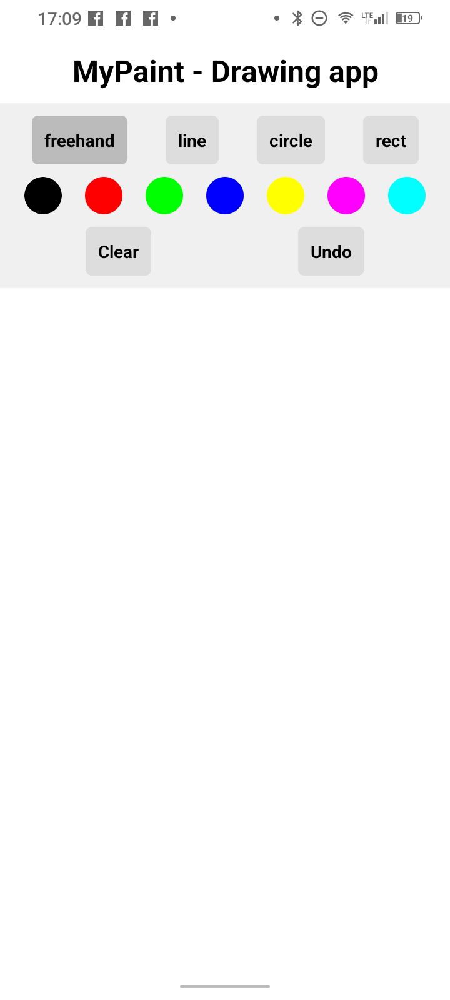

MyPaint - React Native app for drawing

1) Features
   Drawing options: freehand, circle, line,  square, change color

3) Screenshots

3) Installation

git clone https://github.com/GeoTuxMan/MyPaint.github

cd MyPaint

npm install

npm install -g expo-cli

4) Running the App

npx expo start

5) Testing on Physical Decice

Install Expo Go from App Store (iOS) or Google Play (Android)

Start the development server: npx expo start

Scan the QR code with Expo Go app

6) Building the app (.apk)

npm install -g eas-cli

expo install --check

eas build -p android --profile preview

Download apk file from expo.dev
